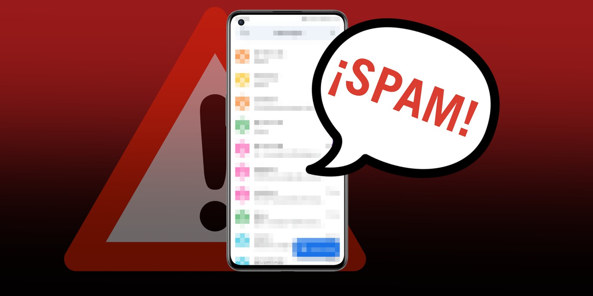

<h1 align="center">📩 SMS Spam Classifier</h1>

<p align="center">
  
</p>

<p align="center">
  🧠 A machine learning-powered app that classifies text messages as <strong>Spam</strong> or <strong>Not Spam</strong> in real-time!
</p>

---

## 🚀 Live Demo

[](https://your-streamlit-url-here.streamlit.app)

---

## 📦 Features

- ✅ Built with **Streamlit**
- 🧹 Custom **text preprocessing** with tokenization, stopword removal, and stemming
- 🧠 Uses a trained **TF-IDF vectorizer + classifier**
- 🔍 Classifies text as **Spam** or **Not Spam**
- 📊 Displays **prediction confidence**
- ☁️ **Word Cloud** visualization of spam keywords
- ⚡ Fast, lightweight, and easy to use!

---

## 🛠️ How to Run Locally

1.  **Clone the repository**
    ```bash
    git clone [https://github.com/your-username/sms-spam-classifier.git](https://github.com/your-username/sms-spam-classifier.git)
    cd sms-spam-classifier
    ```

2.  **Install dependencies** ✅
    ```bash
    pip install -r requirements.txt
    ```

3.  **Download required NLTK resources** ✅
    ```python
    import nltk
    nltk.download('punkt')
    nltk.download('stopwords')
    ```

4.  **Run the Streamlit app** ✅
    ```bash
    streamlit run app.py
    ```

---

## 🧠 Model Info

| Component  | Description                          |
| ---------- | ------------------------------------ |
| Vectorizer | TF-IDF from scikit-learn             |
| Classifier | Multinomial Naive Bayes (or similar) |
| Dataset    | UCI SMS Spam Collection Dataset      |
| Accuracy   | ~98% on test data                    |

---

## 📜 License

MIT License © [Your Name]

---

## 💬 Developer Quotes

> 💡 "Code less. Think more."  
> 📊 "Let data guide the decision, not guesswork."  
> 🚀 "Turning raw numbers into real business stories."  
> 📬 "Even your spam deserves machine learning."